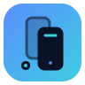

<a id="readme-top"></a>

<div align="center">



# PhoneHub

**Mirror and automate your iPhones and Android phones from one Mac.**

A native macOS app that discovers your connected iPhones and Android phones,
docks their real mirror windows into a single stage — Apple's iPhone Mirroring
for iOS, `scrcpy` for Android — and can drive any one of them toward a
plain-English goal with AI automation presets.

[](https://github.com/benasbarciauskas/PhoneHub/actions/workflows/ci.yml)
[](LICENSE)
[](https://www.apple.com/macos/)
[](https://swift.org)
[](#-ai-presets)
[](https://github.com/benasbarciauskas/PhoneHub/pulls)
[](https://github.com/benasbarciauskas/PhoneHub/stargazers)

</div>

> [!NOTE]
> PhoneHub runs **locally** and holds **no credentials** — discovery, mirroring,
> and automation all happen on your Mac, talking only to the phones `adb` and
> iPhone Mirroring already see.

## ✨ What is PhoneHub?

PhoneHub is a native SwiftUI dashboard that brings every phone on your desk into
one Mac window. It discovers connected **iPhones** (via Apple's iPhone
Mirroring) and **Android phones** (via `adb`), launches each device's real
mirror window, and docks it into a managed stage — so you can watch one phone up
close, or lay several out side by side as a video wall.

On top of the mirror, PhoneHub adds **AI automation presets and device chat**:
a preset is a
plain-English goal, and running it spawns a headless agent that reads the
device's screen and drives it toward that goal — recovering from popups along
the way — while chat lets you ask follow-up questions and request actions in one
persisted conversation. PhoneHub streams active work and always provides Stop.

Everything is native and local. Mirroring uses the OS's own surfaces (iPhone
Mirroring and `scrcpy`); automation shells out to the [mirroir](https://github.com/jfarcand/mirroir-mcp)
(iOS) and [androir](https://github.com/benasbarciauskas/androir-mcp) (Android)
MCP servers plus your locally authenticated LLM CLI. Phase 1 uses `claude`;
Codex backend support is staged for Phase 2. PhoneHub itself is the dashboard
around them.

<p align="right"><a href="#readme-top">back to top ↑</a></p>

## 🚀 Features

- 📱 **Multi-device discovery** — enumerate connected iPhones and Android phones
  in one sidebar, with live state, model, and connection info.
- 🪞 **Native mirroring & docking** — open each device's real mirror window and
  dock it into the PhoneHub stage:
  - **iOS** via Apple's iPhone Mirroring (`com.apple.ScreenContinuity`), placed
    with the macOS Accessibility API.
  - **Android** via borderless `scrcpy -s <serial>`, positioned with scrcpy
    window flags.
- 🎯 **Focus & video-wall layouts** — focus a single device full-stage, or tile
  several into a wall and watch them at once.
- 🤖 **AI automation presets** — name a plain-English goal and let an agent drive
  the focused device toward it via `mirroir` (iOS) / `androir` (Android): it
  reads the screen, decides, taps/swipes/types, and recovers from popups and ads.
- 💬 **Device Chat** — converse with an agent bound to the focused device, ask
  what is on screen, request actions, and keep a per-device transcript across
  app launches.
- 📜 **Live run log & Stop** — every preset run streams its progress into the app
  in real time, with a visible Stop that ends the run immediately.
- 🔒 **Bring your own LLM login** — PhoneHub uses your host user's local
  `claude` (and, in Phase 2, `codex`) CLI login. It never stores or reads API
  keys or account credentials.

<p align="right"><a href="#readme-top">back to top ↑</a></p>

## 📦 Install / Build

### Requirements

- **macOS 14+** with Swift / Xcode (or Command Line Tools) installed.
- **Android:** `brew install android-platform-tools scrcpy` (for `adb` + mirror).
- **iOS docking:** grant PhoneHub **Accessibility** in System Settings →
  Privacy & Security → Accessibility (needed to position the iPhone Mirroring
  window).
- **Automation (optional):** [mirroir](https://github.com/jfarcand/mirroir-mcp)
  (iOS) and/or [androir](https://github.com/benasbarciauskas/androir-mcp)
  (Android) on the host, plus the `claude` CLI for the agent loop.

Install or update the iOS automation skills consumed by mirroir:

```bash
scripts/setup-skills.sh
```

The script clones into `~/.mirroir-mcp/skills` and is safe to rerun. There is
currently no published Android skills repository, so the script reports that
and continues without error.

### Build & run

```bash
./build-app.sh
open PhoneHub.app
```

`build-app.sh` compiles the SwiftPM package in release, assembles `PhoneHub.app`,
generates the app icon, and signs the bundle with a **stable self-signed
identity** (`PhoneHub Self-Signed` in `phonehub-signing.keychain-db`). Stable
signing matters: ad-hoc signing changes the code hash and would force you to
re-grant Accessibility after every rebuild — the persistent identity keeps the
grant alive.

Connect Android devices with USB debugging enabled and authorized, and iOS
devices supported by Apple's iPhone Mirroring. Select a device in the sidebar to
launch and dock its native mirror window into the stage.

### Tests

```bash
CLANG_MODULE_CACHE_PATH=$PWD/.build/cache/clang \
DEVELOPER_DIR=/Applications/Xcode.app/Contents/Developer \
swift test --disable-sandbox
```

CI runs `swift build` and the same `swift test` invocation on `macos-latest` for
every push to `main` and every pull request.

<p align="right"><a href="#readme-top">back to top ↑</a></p>

## 🤖 AI Presets

A **preset** is a named, plain-English goal — for example, *"Open Settings, go to
Wi-Fi, and tell me which network is connected."* Presets are stored in the app
and run against the **focused** device.

When you run a preset, PhoneHub spawns a headless `claude -p` agent wired to the
right MCP server for the focused device's platform — `mirroir` for iOS, `androir`
for Android. The agent then loops:

1. **Read the screen** — describe the current UI (real element bounds / labels).
2. **Decide** the next action toward the goal.
3. **Act** — tap, swipe, type, or launch — and handle popups, ads, and dead ends.
4. **Repeat** until the goal is met.

The whole run streams into PhoneHub's **live log**, and a visible **Stop** ends
it at any time.

<p align="right"><a href="#readme-top">back to top ↑</a></p>

## 💬 Device Chat

Select a focused device, switch the sidebar from **Presets** to **Chat**, and
send a message such as *"What's on screen right now?"* The agent can describe
the current UI, answer follow-ups, and use the attached phone-control tools when
you ask it to act. **Stop** ends the current turn; **New chat** clears that
device's transcript and session.

Chat history is stored per device under
`~/Library/Application Support/PhoneHub/chats/` and restored on launch. A chat
turn and a preset run are mutually exclusive so only one agent controls a phone
at a time.

PhoneHub brings no API key and has no credential store. It shells out to your
own authenticated CLI session. Phase 1 uses the local `claude` CLI; the Codex
backend is planned for Phase 2 and will use the local `codex` login when enabled.

> [!CAUTION]
> Android agent automation depends on `androir-mcp` resolving through npm. If
> the package is unavailable, Android mirroring still works, but Android chat
> and presets cannot start their phone-control MCP server. iOS uses
> `mirroir-mcp`.

<p align="right"><a href="#readme-top">back to top ↑</a></p>

## 🗺️ Status & roadmap

- [x] Multi-device discovery — iOS (iPhone Mirroring) **and** Android (`adb`)
- [x] Native mirroring & docking — iPhone Mirroring (AX-positioned) and
  borderless `scrcpy`
- [x] Focus layout — single device full-stage
- [x] Video-wall layout — tile several mirrors at once
- [x] Mirror menu controls + resync loop (keep docked windows aligned as they move)
- [x] AI automation presets — plain-English goal → agent loop via `mirroir` /
  `androir`, with a live run log and Stop
- [x] Per-device chat with streaming replies, Stop, and persisted transcripts
- [x] Stable self-signed build so the Accessibility grant survives rebuilds
- [ ] Per-device preset-run history
- [ ] Scheduling / recurring presets
- [ ] Richer wall layouts (custom grids, per-tile zoom)
- [ ] Packaged, notarized `.app` release

This README and roadmap fill in progressionally as the project grows.

<p align="right"><a href="#readme-top">back to top ↑</a></p>

## 📄 License

[Apache-2.0](LICENSE).

<p align="right"><a href="#readme-top">back to top ↑</a></p>

---

## PhoneDrop — drag-to-phone Dock droplet

Drag a photo onto the PhoneDrop Dock icon → strips EXIF/GPS metadata (on a copy, original untouched) → pushes it directly to your Motorola via `adb over Tailscale` → auto-appears in the phone's gallery. Works across any network; no web server, no tap required on the phone.

### One-time setup

1. **Phone — Tailscale:** Install the Tailscale app, log into your tailnet. On Android, enable always-on VPN for Tailscale and exclude Tailscale from battery optimization.
2. **Phone — Wireless Debugging:** Developer Options → Wireless debugging → enable it, then pair with the Mac once (`adb pair <ip>:<port>`). After pairing, run `adb tcpip 5555` on the Mac to pin a stable port.
3. **Mac — install PhoneDrop:**
   ```bash
   scripts/phonedrop.sh install
   ```
   When prompted, enter the phone's Tailscale MagicDNS hostname (e.g. `motorola`). If not prompted, edit `~/.config/phonedrop/config` and set `PHONE_HOST`.
4. **Dock:** Drag `~/Applications/PhoneDrop.app` to your Dock.

### Usage

- **Drop photos** onto the PhoneDrop Dock icon — they land in the Motorola's gallery.
- Drops use wireless adb over Tailscale when available, and fall back to USB automatically when a cable is connected.
- After a phone reboot, Android resets the wireless adb listener. Plug in via USB and PhoneDrop auto-arm will re-enable wireless adb automatically; you can still run `scripts/phonedrop.sh rearm` manually.
- Auto-arm is installed as a LaunchAgent by `scripts/phonedrop.sh install`, checks for a USB-connected phone every 30 seconds, and writes to `~/Library/Logs/phonedrop-autoarm.log`. Disable it with `scripts/phonedrop.sh autoarm-disable`.
- **CLI:**
  ```bash
  scripts/phonedrop.sh connect      # Test the adb connection
  scripts/phonedrop.sh rearm        # Re-enable wireless adb after a phone reboot
  scripts/phonedrop.sh autoarm-disable # Disable automatic wireless adb re-arm
  scripts/phonedrop.sh status       # Show config, tool paths, adb state
  scripts/phonedrop.sh config       # Print config path and values
  scripts/phonedrop.sh check        # Run smoke tests
  scripts/phonedrop.sh push file1.jpg "photo with spaces.jpg"
  ```

### Tests (no phone required)

```bash
bash tests/phonedrop_test.sh
```

Asserts config parsing, arg quoting with spaces, and that `exiftool -all=` actually removes GPS/EXIF tags.

<p align="right"><a href="#readme-top">back to top ↑</a></p>
